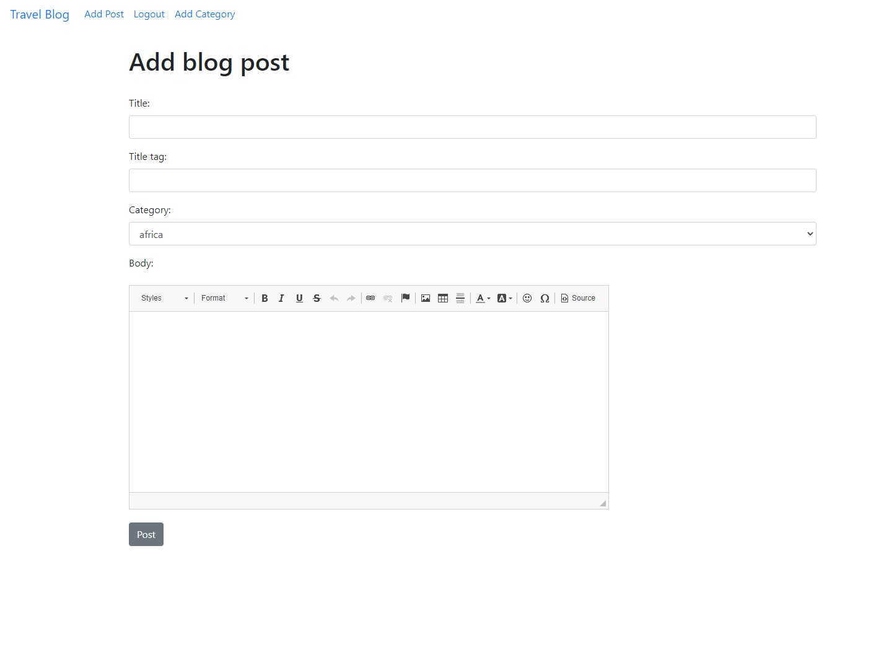

# Rebaz Travel Blog

Join Rebaz on his travels and discuss where to go next! This Django based blog allows users to create their own account so that they
can leave blog posts, add categories, comments and likes. This simple and easy to use blog is for the creator and users to share travel tips and memories.

[View Rebaz Travel Blog Live Website Here](https://rebazptravelblog-3e0a8b8b8d3b.herokuapp.com/)
---

## Table of Contents
### [User Experience](#user-experience-ux)
* [Project Goals](#project-goals)
* [Agile Methodology](#agile-methodology)
* [Target Audience](#target-audience)
* [First time user](#first-time-user)
* [Registered user](#registered-user)
* [Admin user](#admin-user)
### [Design](#design-1)
* [Images](#images)
* [Wireframes](#wireframes)
* [Data Model](#data-models)
* [User Journey](#user-journey)
* [Database Scheme](#database-scheme)
### [Security Features](#security-features-1)
### [Features](#features-1)
* [Existing Features](#existing-features)
* [Features Left to Implement](#features-left-to-implement)
### [Technologies Used](#technologies-used-1)
* [Languages Used](#languages-used)
* [Databases Used](#databases-used)
* [Frameworks Used](#frameworks-used)
* [Programs Used](#programs-used)
* [Installed Packages](#installed-packages)
### [Deployment and Local developement](#deployment-and-local-developement-1)
* [Local Developement](#local-developement)
* [ElephantSQL Database](#elephantsql-database)
* [Cloudinary](#cloudinary)
* [Heroku Deployment](#heroku-deployment)
### [Testing](#testing-1)
### [References](#references-1)
* [Docs](#docs)
* [Content](#content)
* [Acknowledgments](#acknowledgments)
---

## User Experience (UX)

Join in on simple to use travel blog and share travel memories and tips. No advance UI or features, instead easy to read and use blog with just the necessary functions. Interact with your own blog posts, comments and like/unlike posts. Users can even create their own categories to expand the blog. 

### Project Goals

The goal with this project is to share traveltips and memories through text and pictures. Engage with readers through creating blog posts and comments. Also give the ability for users to create their own categories.

### Agile Methodology

Agile Methodology was used to help prioritize and organize tasks, writting the user stories and using project boards on github. Template was created to help write user stories and epics.

* Epics were written containing possible user stories and based on that the blog was made.
* User stories were created by looking at epics and through iterations the project was advancing.
* Project board is set to public.
* Project board was used to track progression of the task through the todo, in progress and done columns.
* Labels were added to sort the issues based on the importance.

 User Stories Template

 User Stories, Issues

 Project Board

### User Stories

#### Epics
1. User interaction with posts
2. User engagement with content
3. Account management
4. Content creation and management

#### User Stories
1. View paginated list of posts
* Given more than one post in the database, these multiple posts are listed
* When a user opens the main page a list of posts is seen
* Then the user sees all post titles with pagination to choose what to read
2. Open a post
* When a blog post title is clicked on a detailed view of the post is seen
3. View comments
* Given one or more user comments the admin can view them
* Then a site user can click on the comment thread to read the conversation
4. Account registration
* Given an email a user can register an account
* Then the user can log in
* When the user is logged in they can comment
5. Comment on post
* When a user comment is approved
* Then a user can reply
* Given more than one comment then there is a conversation thread
6. Modify or delete comment on a post
* Given a logged in user, they can modify their comment
* Given a logged in user, they can delete their comment
7. Manage posts
* Given a logged in user, they can create a blog post
* Given a logged in user, they can read a blog post
* Given a logged in user, they can update a blog post
* Given a logged in user, they can delete a blog post
8. Likes
* Given one or more user likes the user / admin can view them

Detailed look can be found in the [Project Board](https://github.com/users/rebazp/projects/6)

### Target Audience

* People seeking travel tips.
* People seeking to share travel tips.

### First Time User

* Simple and intuitive blog with easy navigation.
* Easy Registration process.
* Simple to use on any device.

### Registered User

* Seamless login process with a secure and personalized user account.
* Browsing through categories and see related posts and comments.
* Give comments likes and dislikes.
* Create new categories.

### Admin User

* Secure and separate login portal for admin users with appropriate access control.
* Access to an admin dashboard for managing users, posts, comments and likes/dislikes.
* Ability to add, edit, or delete user, posts, comments likes/dislikes.

## Design

The travel blog uses a easy to read and navigate layout with only the necessary functions. The dropdown navbar with categories is only accessible in on the homepage to keep the layout clean and easy to use. 

### Images

All images used in blog posts are taken from google search.

### Wireframes

 Home page

 Home page when logged in

 Login page

 Register page

 Add post page

 Add comment page

 Add category page

### Data Models

1. AllAuth User Model
    * Django Allauth, the User model is the default user model provided by the Django authentication system
    * The User entity has a many-to-many relationship with the blog posts. This means that a User can have many blog posts and interact with other blog posts through likes, comments, edits, deletes etc.
---
2. Category Model
    * Data model created so authenticated user can create new categories.
    * Only Admin can change the data in the backend.
    * Users can only view and create categories.

3. Post Model
    * As a user you can create blog posts.
    * Admin can add, delete and update posts through djangos admin panel.
    * Only Admin can change the data in the backend.
    * User can see the posts created by other users.
    * Tools to be used in posts are: title, title tag, author, body, post date, category and likes.
    * Full CRUD functionality is available to the user.
---
4. Comment Model
    * As a user you can create blog comments.
    * Admin can add, delete and update comments through djangos admin panel.
    * Only Admin can change the data in the backend.
    * Tools to be used in comments are: author, body, post date, category.
    * Full CRUD functionality is available to the user.
    ---

### User Journey 

### Database Scheme

Entity Relationship Diagram (ERD)

## Security Features

### User Authentication

* Django Allauth is a popular authentication and authorization library for Django, which provides a set of features for managing user authentication, registration, and account management.

### Login Decorator

* add_category, add_comment, add_post, article_details, delete_post and update_post: These views allows user to interact with the blog and requires user authentication.
* This ensures that only authenticated users can access these views.

### CSRF Protection

* Django provides built-in protection against Cross-Site Request Forgery (CSRF) attacks. CSRF tokens are generated for each user session, and they are required to submit forms or perform state-changing actions. When a user logs out, the session and associated CSRF token are invalidated, making it difficult for an attacker to forge a valid request using a copied URL.

## Features

* Home page showcases most recent blog posts and the navigation bar.
* User can make an account, login and and logout.
* When logged in, users can add post, comment and category.
* Users can edit and delete their posts and comments.
* User can like or dislike blog posts.

### Existing Features

* Home page
    * Displays a navigation bar at the top and blog posts in the center of the page.

* Once logged in the Add post and Add category links appear.

* Category navbar
    * Display a dropdown navbar with categories.

* Navigation Bar
    * It differs if its a user or visitor.
    * Navigation bar for a visitor.

    

    * Navigation bar for a user.
    

* Sign up
    * User can create an account.

* Login
    * User can login into an account, if they have created one.

* Create blog post
    * Users can create blog post by clicking on the add blog post button.
    * Form validation is implemented to make sure form are submitted correctly and if there is an error user will be notified with alert message.
    * When user creates blog post they get redirected to homepage.

* Update blog post
    * Users can update blog post they created by pressing on the edit button.
    * When user update blog post they get redirected to homepage.

* Delete blog post
    * Users can delete a blog post they created by pressing on the delete button.
    * When user delete blog post they get redirected to homepage.

* View blog post
    * When user press on a blog post they can see the content of the blog post, comments and likes. If they are the creator of the blog post then they can edit or delete blog post.
    

* Comment blog post
    * Users can comment blog post by pressing on the comment button.
    * When user comment blog post they get redirected to homepage.

* Add category
    * User can add categories to expand the blog further.
    * When user comment blog post they get redirected to homepage.

* Inside category
    * Inside the category page the user can see which posts have been made in that specific category.

* Like & dislike blog post
    * User can like or dislike blog posts.
    * When user have pressed the button the total likes changes.

* Admin Features
    * Django built in admin panel allows admin control over the website.
    * Admin can access admin panel through his navigation bar.
    * Can add, update, delete user, post, comment, like, category and groups.

### Features Left to Implement 

* Implement search functionality, enabling users to search for posts based on blog post content.
* Uppload own pictures and not just urls.
* Show post images on home page.
* More advanced design and layout.
* Feature to abort delete post and go straight back viewed post.
* For the purposes of this project these implemenation were not necessary.

## Technologies Used

### Languages Used

* [HTML5](https://en.wikipedia.org/wiki/HTML5)
* [CSS3](https://en.wikipedia.org/wiki/CSS)
* [JavaScript](https://en.wikipedia.org/wiki/JavaScript)
* [Python](https://en.wikipedia.org/wiki/Python_(programming_language))

### Databases Used

* [ElephantSQL](https://www.elephantsql.com/) - Postgres database.
* [Cloudinary](https://cloudinary.com/) - Online static file storage.

### Frameworks Used

* [Django](https://www.djangoproject.com/) - Python framework.
* [Bootstrap 5.3](https://getbootstrap.com/docs/5.3/getting-started/introduction/) - CSS framework.

### Programs Used

* [Github](https://github.com/) - Storing the code online.
* [Gitpod](https://www.gitpod.io/) - To write the code.
* [Heroku](https://www.heroku.com/) - Used as the cloud-based platform to deploy the site.
* [Google Fonts](https://fonts.google.com/) - Import main font the website.
* [Moqups](https://moqups.com/) - Used to create wireframes and schemes.
* [Am I Responsive](https://ui.dev/amiresponsive) - To show the website image on a range of devices.
* [Git](https://git-scm.com/) - Version control.
* [JSHint](https://jshint.com/) - Used to validate JavaScript.
* [W3C Markup Validation Service](https://validator.w3.org/) - Used to validate HTML.
* [CSS Validation Service](https://jigsaw.w3.org/css-validator/) - Used to validate CSS.
* [CI Python Linter](https://pep8ci.herokuapp.com/#) - Used to validate Python.

### Installed Packages
- asgiref==3.7.2
- dj-database-url==0.5.0
- Django==4.2.10
- django-ckeditor==6.7.1
- django-js-asset==2.2.0
- gunicorn==20.1.0
- psycopg2==2.9.9
- sqlparse==0.4.4
- whitenoise==6.5.0

## Deployment and Local Developement

Live deployment can be found on this [View Rebaz Travel Blog Live Website Here](https://rebazptravelblog-3e0a8b8b8d3b.herokuapp.com/)

### Local Developement

#### How to Fork
1. Log in(or Sign Up) to Github.
2. Go to repository for this project [Travel Blog](https://github.com/rebazp/TRAVELBLOG)
3. Click the fork button in the top right corner.

#### How to Clone
1. Log in(or Sign Up) to Github
2. Go to repository for this project [Travel Blog](https://github.com/rebazp/TRAVELBLOG)
3. Click on the code button, select whether you would like to clone with HTTPS, SSH or GitHub CLI and copy the link shown.
4. Open the terminal in your code editor and change the current working directory to the location you want to use for the cloned directory.
5. Type the following command in the terminal (after the git clone you will need to paste the link you copied in step 3 above)
6. Set up a virtual environment (this step is not required if you are using the Code Institute Template in GitPod as this will already be set up for you).
7. Install the packages from the requirements.txt file - run Command pip3 install -r requirements.txt

### ElephantSQL Database
[Travel Blog](https://github.com/rebazp/TRAVELBLOG) is using [ElephantSQL](https://www.elephantsql.com/) PostgreSQL Database

1. Click Create New Instance to start a new database.
2. Provide a name.
3. Select the Tiny Turtle (Free) plan.
4. You can leave the Tags blank.
5. Select the Region and Data Center closest to you.
6. Once created, click on the new database name, where you can view the database URL and Password.

### Cloudinary
[Travel Blog](https://github.com/rebazp/TRAVELBLOG) is using [Cloudinary](https://cloudinary.com/)
1. For Primary interest, you can choose Programmable Media for image and video API.
2. Optional: edit your assigned cloud name to something more memorable.
3. On your Cloudinary Dashboard, you can copy your API Environment Variable.
4. Be sure to remove the CLOUDINARY_URL= as part of the API value; this is the key.

### Heroku Deployment
* Log into [Heroku](https://www.heroku.com/) account or create an account.
* Click the "New" button at the top right corner and select "Create New App".
* Enter a unique application name.
* Select your region.
* Click "Create App".

#### Prepare enviroment and settings.py
* In your GitPod workspace, create an env.py file in the main directory.
* Add the DATABASE_URL value and your chosen SECRET_KEY value to the env.py file.
* Update the settings.py file to import the env.py file and add the SECRETKEY and DATABASE_URL file paths.
* Comment out the default database configuration.
* Save all files and make migrations.
* Add the Cloudinary URL to env.py
* Add the Cloudinary libraries to the list of installed apps.
* Add the STATIC files settings - the url, storage path, directory path, root path, media url and default file storage path.
* Link the file to the templates directory in Heroku.
* Change the templates directory to TEMPLATES_DIR.
* Add Heroku to the ALLOWED_HOSTS list the format ['app_name.heroku.com', 'localhost'].

#### Add the following Config Vars in Heroku:

* SECRET_KEY - This can be any Django random secret key.
* CLOUDINARY_URL - Insert your own Cloudinary API key.
* PORT = 8000
* DISABLE_COLLECTSTATIC = 1 - this is temporary, and can be removed for the final deployment.
* DATABASE_URL - Insert your own ElephantSQL database URL here.

#### Heroku needs two additional files to deploy properly

* Requirements.txt
* Procfile

#### Deploy

1. Make sure DEBUG = False in the settings.py.
2. Go to the deploy tab on Heroku and connect to GitHub, then to the required repository.
3. Scroll to the bottom of the deploy page and either click Enable Automatic Deploys for automatic deploys or Deploy Branch to deploy manually. Manually deployed branches will need re-deploying each time the GitHub repository is updated.
4. Click 'Open App' to view the deployed live site.

Site is now live

## Testing
Please see  [TESTING.md](TESTING.md) for all the detailed testing performed.

## References
For thhis project I have used help from the Code Institute example project I think therefore i blog and some Youtube channels. Most of the code that I have used in this project is my own which I have learned during my time studying at Code Institute.

* Code Institute project 4 [I Think Therefore I Blog](https://learn.codeinstitute.net/courses/course-v1:CodeInstitute+FSD101_WTS+2023_Q3/courseware/56a2da0940b4411d8a38c2b093a22c60/4565659a34d648b8b8edd063c3182180/)
* Youtube series Django Tutorial by [Net Ninja](https://www.youtube.com/watch?v=n-FTlQ7Djqc&list=PL4cUxeGkcC9ib4HsrXEYpQnTOTZE1x0uc&index=1&ab_channel=NetNinja)
* Youtube series Python Django Tutorial by [Corey Schafer](https://www.youtube.com/watch?v=UmljXZIypDc&list=PL-osiE80TeTtoQCKZ03TU5fNfx2UY6U4p&index=1&ab_channel=CoreySchafer)
* Yoube Python Django Web Framework by [FreeCodeCamp](https://www.youtube.com/watch?v=F5mRW0jo-U4&ab_channel=freeCodeCamp.org)

### Docs
I have utilised many websites for this project and this is some of them.

* [W3 Schools](https://www.w3schools.com)
* [Stack Overflow](https://stackoverflow.com/)
* [Code Institute](https://learn.codeinstitute.net/dashboard)
* [Bootstrap 5.3](https://getbootstrap.com/docs/5.3/getting-started/introduction/)
* [Django docs](https://docs.djangoproject.com/en/4.2/contents/)
* [Django Allauth](https://django-allauth.readthedocs.io/en/latest/)
* [Django and Static Assets](https://devcenter.heroku.com/articles/django-assets)
* [Cloudinary](https://cloudinary.com/documentation/diagnosing_error_codes_tutorial)
* [Google](https://www.google.com/)

### Content

* All of the content is imaginary and written by the developer, me, Rebaz Pappiland.
* All images were taken from www.google.com

### Acknowledgments

* I would like to thank the tutors at Code Institute for their help.
* I would like to thank Thomas Tomo for his amazing README which gave me inspiration for mine.
* I would also like to extend my appreciation to the Slack community for their continuous engagement and willingness to share knowledge adn help me through my projects. The collaborative environment provided a platform for learning, troubleshooting, and gaining inspiration from fellow developers.