# Travel Blog | Testing

Return to [README](README.md)
- - -
Comprehensive testing has been performed to ensure the website's seamless and optimal functionality.

## Table of Contents
### [Responsiveness Testing](#responsiveness-testing-1)
### [Browser Compatibility Testing](#browser-compatibility-testing-1)
### [Device Testing](#device-testing-1)
### [Code Validation](#code-validation-1)
* [HTML Validation](#html-validation)
* [Python](#python)
### [Lighthouse Report](#lighthouse-report-1)
### [Bugs](#bugs-1)
* [Resolved Bugs](#resolved-bugs)
* [Unresolved Bugs](#unresolved-bug)
### [Features Testing](#features-testing-1)
---

## Responsiveness Testing

The deployed website underwent rigorous testing on multiple devices and screen sizes to ensure its responsiveness and adaptability. Developer Tools were utilized to simulate various screen sizes, enabling thorough examination of how the website behaves across different devices. Bootstrap classes and media queries were implemented to achieve the desired design, ensuring that the website maintains its visual and functional integrity on all platforms, enhancing the user experience.

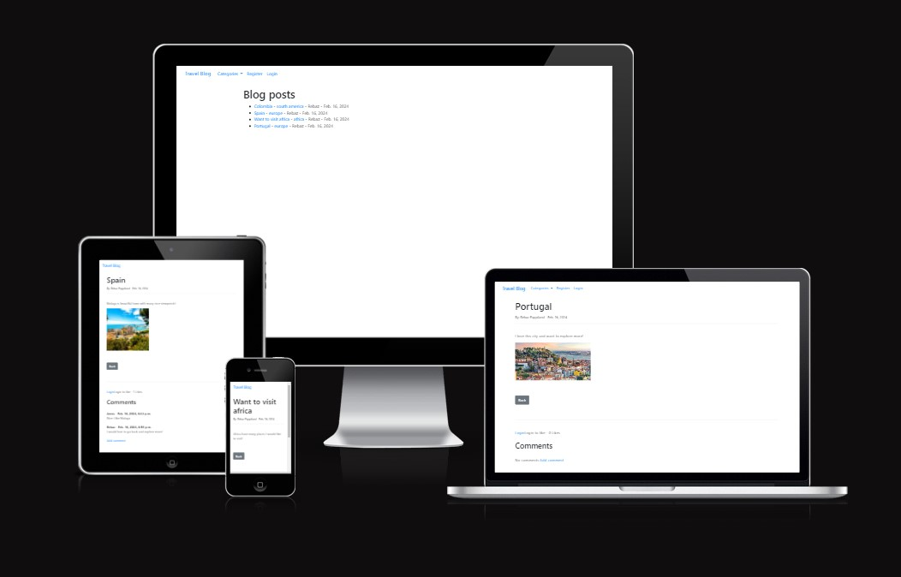

## Browser Compatibility Testing

The project was tested on multiple web browsers to check for compatibility issues and ensure it functions as expected across all of them. This testing process guarantees a smooth and consistent user experience, regardless of the browser used.

 Chrome

 Microsoft Edge

 Opera

 Firefox

 Samsung Internet (Mobile)

## Device Testing

Device testing was conducted on a variety of phone models, including Samsung Galaxy, iPhone and Sony. The assistance of family members and friends was sought to perform the testing. This comprehensive approach ensured that the website was thoroughly evaluated on different devices and platforms, contributing to a more robust and user-friendly final product.

## Code Validation

### HTML Validation

 Home Page

 Register Page

 Login Page

 Logout Page

 Category Page

 Add Post Page

 Add Category Page

 View Post Page

 Edit Post Page

 Delete Post Page

 Add Comment Page

 Category Doesn't Exist Page

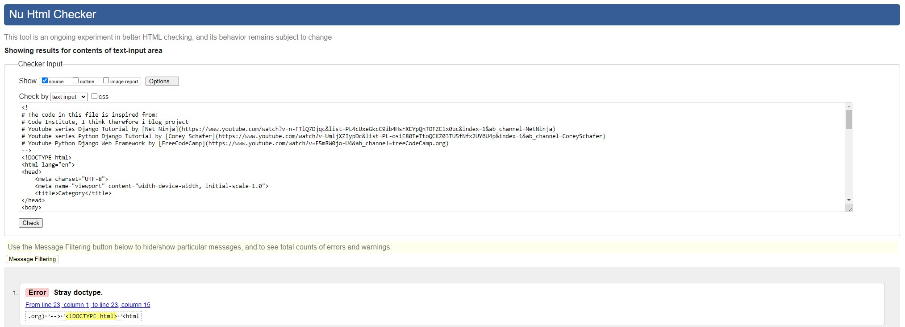

### Python

#### travel app

 admin.py

 forms.py

 models.py

 views.py

 urls.py

#### travelblog project

 settings.py

 urls.py

## Lighthouse Report

 Home Page

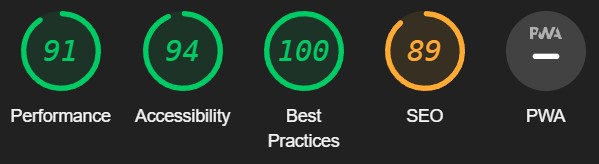

 Register Page

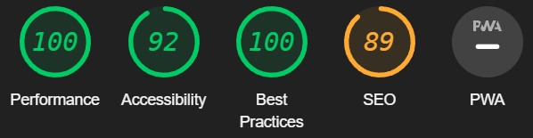

 Login Page

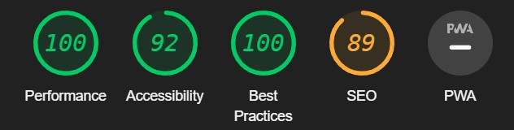

 Logout Page

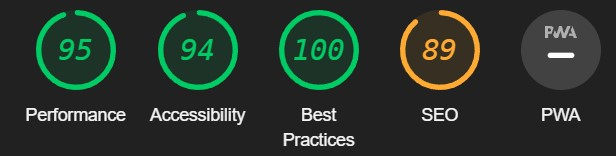

 Category Page

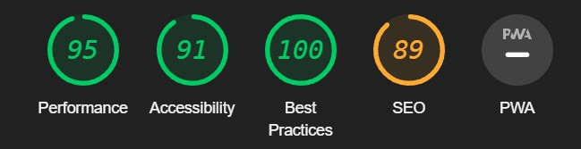

 Add Post Page

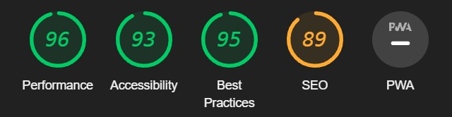

 Add Category Page

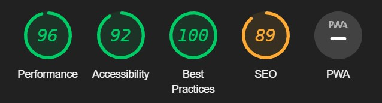

 View Post Page

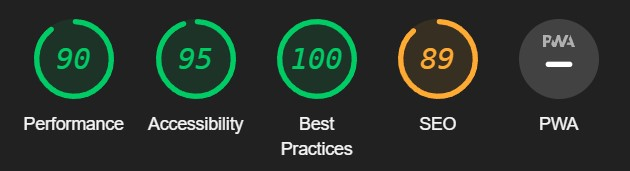

 Edit Post Page

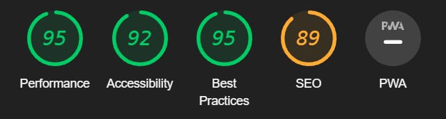

 Delete Post Page

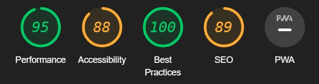

 Add Comment Page

 Category Doesn't Exist Page

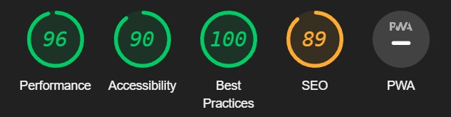

## Bugs

### Resolved Bugs

#### Categories not working properly.

* When I made a blogpost in a category and pressed on the category to see the posts in that category I got the error message "this category doesn't exist". This was because when creating categories I spelled them with capital letters while the code was looking for the url with lower case letters. I solved this by changing the name of the categories to lower letters.

#### User name not showing in blog posts.

* When creating a new blog post as a normal user their name didn't appear on the homepage after the category name. This was because when creating a normal user I only specified their first name and not last name. I changed the code to: post.author.get_full_name to solve this issue.

### Unresolved Bug

* There are no unresolved bugs.

## Features Testing

Return to [README](README.md)